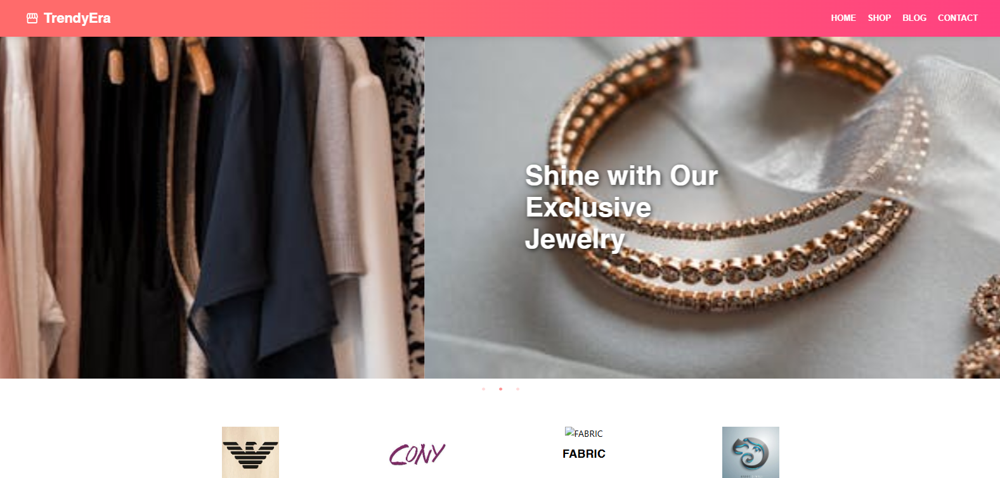
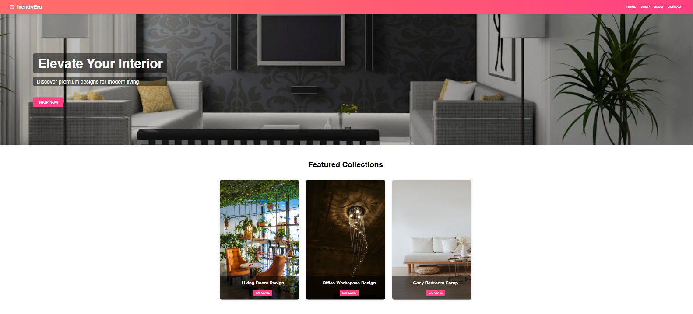
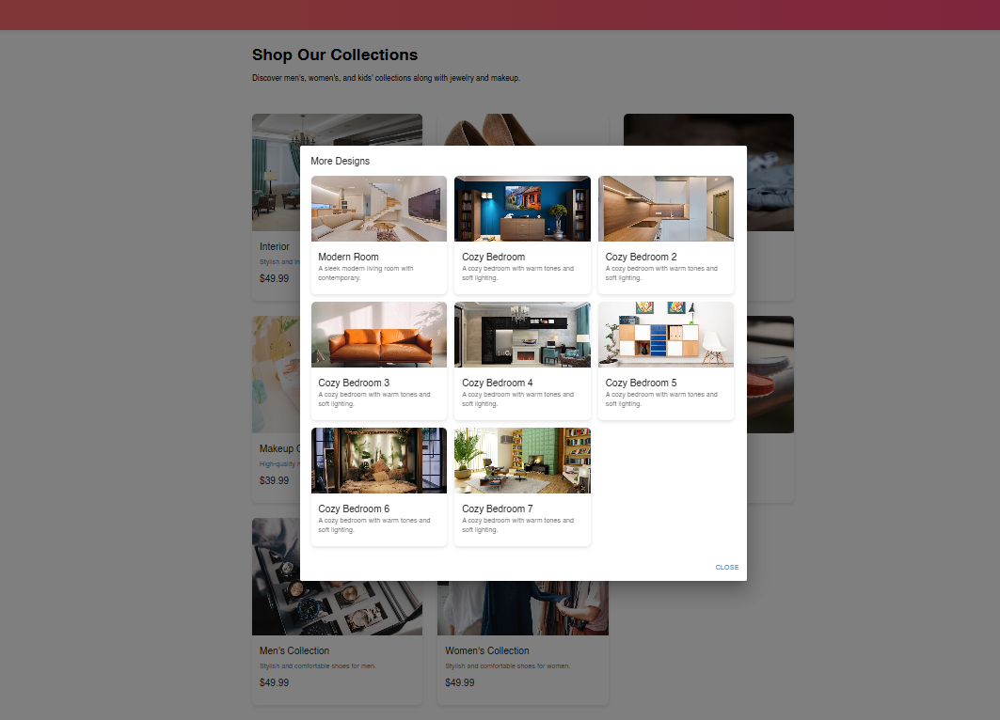
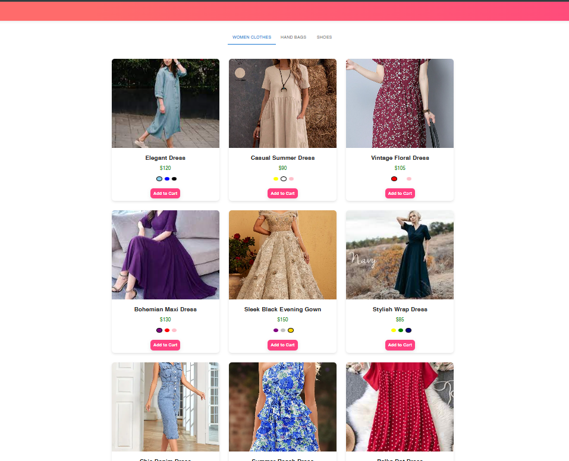
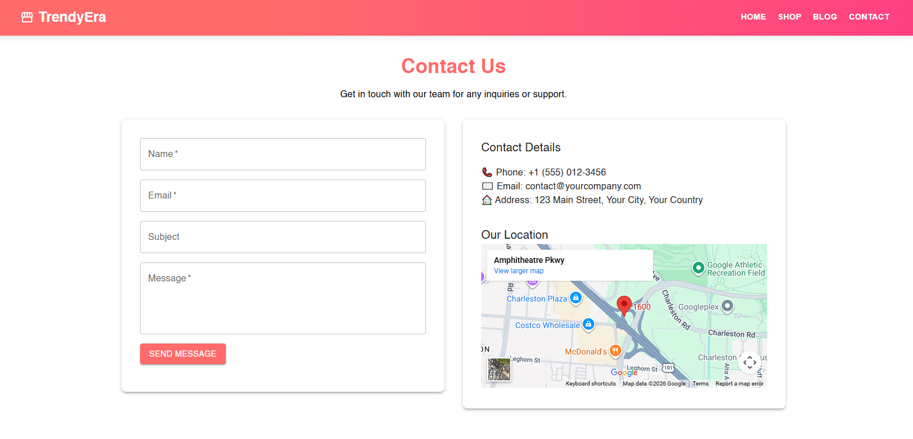

# TrendyEra - MERN E-Commerce Store

A full-stack **MERN** (MongoDB, Express.js, React, Node.js) e-commerce application with a modern UI built using **Material UI (MUI)**. TrendyEra is an online store featuring collections for **Interior Design**, **Men's Fashion**, **Women's Fashion**, **Kids Wear**, and **Makeup Products**.

Users can browse categories, view product details, add items to cart, and manage their shopping experience. All product data is stored and managed in **MongoDB**.

## 📦 Technologies Used
- **Frontend**: React.js + Material UI (MUI) for responsive and beautiful components
- **Backend**: Node.js + Express.js (RESTful APIs)
- **Database**: MongoDB (with Mongoose for schema and data modeling)
- **State Management**: Context API or Redux (if used)
- **Other**: Axios for API calls, React Router for navigation

## 🦄 Features
Here's what you can do in TrendyEra:

- Browse multiple collections: **Interior Design**, **Men**, **Women**, **Kids**, and **Makeup**
- View detailed product pages with images, descriptions, prices, and availability
- **Add to Cart** functionality add, update quantity, remove items
- Responsive & modern UI with **MUI** cards, grids, buttons, and dialogs
- Real-time cart updates and total calculation
- Product data fetched from **MongoDB** backend
- Basic user-friendly navigation (Home, Categories, Cart)

## 🎯 Project Focus
- Full MERN stack integration: frontend talks to backend APIs
- Storing and fetching product collections (Interior, Fashion, Makeup) from MongoDB
- Building a clean, professional e-commerce UI with Material UI
- Implementing cart logic without external libraries (pure React + Context/State)
- Ensuring responsive design across devices

## 👩🏽‍🍳 The Process & What I Learned
Started with designing the database schema in MongoDB for different collections (products with categories like Interior, Men, etc.).

Built backend APIs for fetching products and categories.

On frontend: Set up React with MUI theme, created reusable components (ProductCard, CartItem), and connected to backend.

Learned:
- How to model multi-category data in MongoDB
- Secure API endpoints and data fetching with Axios
- Advanced MUI customization (themes, custom components)
- Cart state management and UI updates
- Building a complete e-commerce flow from scratch

## 💭 How Can It Be Improved?
- Add user authentication (login/signup, protected cart)
- Implement checkout & payment gateway (Stripe/PayPal)
- Add search and filter functionality
- Wishlist / Favorites feature
- Admin dashboard to add/edit products
- Dark mode toggle with MUI
- Infinite scroll or pagination for large collections
- Deploy to Vercel (frontend) + Render/Heroku (backend)

## 🚦 Running the Project Locally
1. Clone the repository
2. npm init
3. npm start

## Screenshots

### TrendyEra

   
